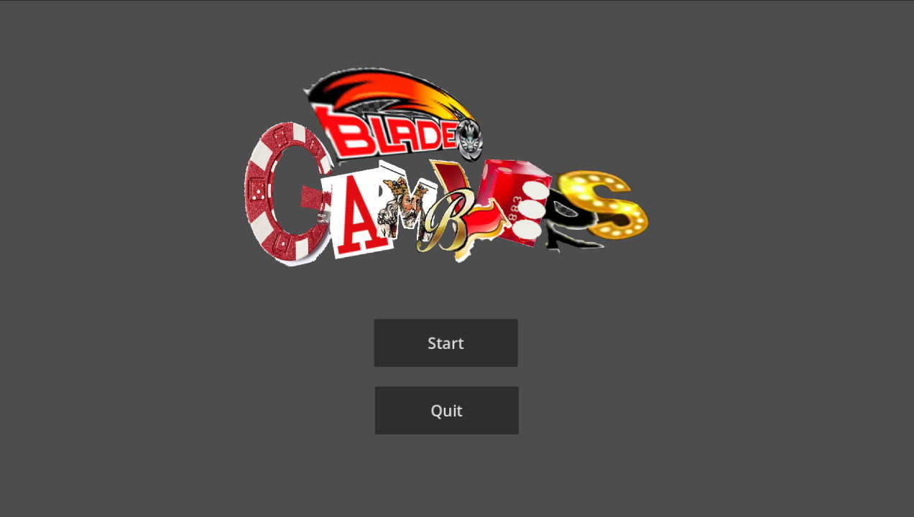
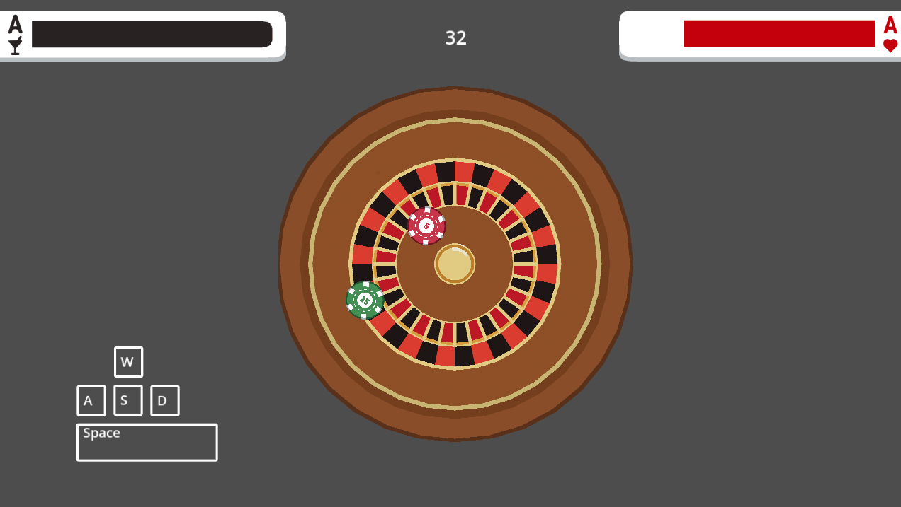

# Blade Gamblers

A fast, physics-based beyblade arena game made for The Very Serious Juniper Dev Game Jam. Control your beyblade, manage its stamina, and knock the enemy out before the match timer reaches zero.

This project is configured for Windows and mobile (Android).

## How to Play

1. Start the game from the title screen.
2. Steer your beyblade into the enemy to deal collision damage.
3. Build up speed and use boosts strategically. Faster impacts deal more damage.
4. Burst the enemy before the 45-second timer expires.

You win when the enemy's health reaches zero. You lose when the timer expires while the enemy is still standing, or when your beyblade is knocked out.

## Controls

| Action | Key |
| --- | --- |
| Move | `W` `A` `S` `D` |
| Boost | `Spacebar` |
| Pause / resume | `Escape` |
| Start from the title screen | `Enter` |

Boosting consumes stamina. Stamina recharges while you are not boosting, but it must refill completely after overheating before boosting becomes available again.

## Features

- Physics-driven beyblade movement and collisions
- AI-controlled enemy beyblade
- Health, stamina, and match timer HUD
- Speed-based collision damage and knockback
- Pause, resume, restart, and quit controls
- Sound effects and music

## Running Locally

### Requirements

- [Godot Engine 4.7](https://godotengine.org/)

### Steps

1. Clone or download this repository.
2. Open the project folder in Godot.
3. Run the project. The configured main scene is `scenes/welcome.tscn`.

The project uses the GL Compatibility renderer and a 1920x1080 viewport with a 1280x720 window override.

## GitHub Builds

The **Build Windows and Android** Actions workflow runs only on pushes to `main`.
It uses Godot 4.7 and downloads matching export templates.

After a successful run, download its artifacts:

- **BladeGamblers-Windows**: extract the archive and run `BladeGamblers.exe`.
  Game data is embedded in the EXE.
- **BladeGamblers-Android-debug**: extract and install `BladeGamblers-debug.apk`
  on an ARM64 Android device.

GitHub generates a fresh debug keystore for every run. No local keystore or
repository secrets are required, and the keystore is not uploaded. Because each
run uses a different signing key, uninstall a previous build before installing
a build from another run; uninstalling removes its local game data. This APK is
for testing, not Play Store publishing.

CI uses `ci/export-presets.cfg` and `ci/build.sh`; local `export_presets.cfg`
remains ignored. The script is intended for disposable GitHub Actions checkouts.
See [Godot's Android export documentation](https://docs.godotengine.org/en/4.7/tutorials/export/exporting_for_android.html)
for signing and SDK details.

## Project Structure

- `scenes/` - Godot scenes for the title screen, arena, and beyblade
- `scripts/game/` - Beyblade physics, stadium setup, and arena logic
- `scripts/ui/` - HUD, menus, input display, and title-screen behavior
- `assets/` - Sound, music, and interface art

## Screenshots

